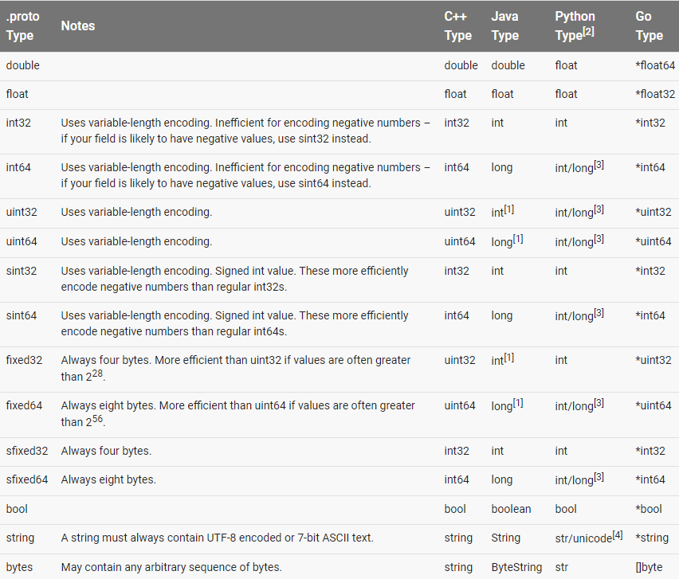

翻译问题全文搜索：翻译问题
语言指南
====

[定义消息类型]()  
[标量值类型]()  
[可选值和默认值]()  
[枚举]()  
[使用其他消息类型]()  
[嵌套类型]()  
[更新消息类型]()  
[拓展]()  
[Oneof 字段]()  
[Maps]()  
[Packages]()  
[定义服务]()  
[选项]()  
[生成一个类]()  

此文档将介绍如何使用protocol buffer来构造protobuf数据，包括`proto`文件的书写语法和生成数据访问类的方式。包括**proto2**版本。欲了解更多有关**proto3**的内容，请访问[Proto3语言指南]()。  

这是一个参考指南——对于许多功能，要想了解更多深层次的示例，请参考所选语言的[教程]()。  

## 定义消息类型

首先来看一个非常简单的例子。假设要定义一个查询请求格式的消息，包括一个查询字符串，所查询的感兴趣页面，每一页中符合查询要求的结果数。下面是下面是代码：  

```protobuf
    message SearchRequest{
    	required string query = 1;
    	optional int32 page_number = 2;
    	optional int32 result_per_page = 3;
    }
```

`SearchRequest`消息的定义指明了三个字段（键/值对），我们希望获得的数据就包含在这样类型的消息中。每个字段都有一个名字和一个类型。

### 指明字段类型
在上面的例子中，所有的字段都是标量类型：两个整型（`page_number`和`result_per_page`）和一个字符串（`query`）。同样的，也可以为字段指定符合类型，包括枚举和其它消息类型。

### 分配标签
如你所见，消息定义中的每个字段都有一个唯一的数字标签。这些标签用来识别在消息的二进制格式中定义的字段，并且一旦使用了这些标签，就不应该再改变它们。注意从1到15的标签只需要一个字节编码，包括识别序号和字段类型（可以在[Protocol Buffer编码]()中找到更多相关信息）。从16到2047的标签需要两个字节。所以我们应该将1到15的标签用于频繁使用的消息。同样的，也应该预留一些标签用于以后可能增加的情况。

可以指定的最小标签数字是1，可以指定的最大标签数字是2^29-1（536870911）。位于19000到19999的标签不可使用。（FieldDescriptor::kFirstReservedNumber到FieldDescriptor::kLastReserNumber），这些标签是供Protocol Buffers所使用的——当你在`proto`文件中使用这个区间内的标签时，protocol buffers编译器将会给出警告。同样的，你也不能使用预先定义保留标签。


### 指定字段规则

消息字段是以下之一：
- `required`：一个好的消息格式必须要包括这个字段。
- `optional`：一个好的消息格式可以有零个或一个此字段。（但不可多于一个）
- `repeated`：此字段可以重复任意多次（包括零次），并且值的顺序会被记录。

因为历史性的原因，标量数字类型的`repeated`字段的编码效率并不如想象中的那样好。在今后的代码中应该使用特殊的选项`[packed=true]`来更高效地编码。比如：

```protobuf
    repeated int32 samples = 4 [packed=true];
```

在[Protocol Buffer编码]()中可以获取更多有关于`packed`的信息。

**Required是永久的**：在将字段声明成**required**的时候，读者应该非常小心。如果因为某些原因读者希望停止写和发送required字段，那么在将其转换为optional字段时，将产生一些严重的问题——在旧式读取中这样的字段可能会被认为是不完整的，从而无意中拒绝或删除此字段。读者应该考虑为buffers编写特定的、针对应用程序的自定义验证过程。谷歌的一些工程师的出这样的结论：使用**required**弊大于利；他们更偏向于只用**optional**和**repeated**字段。但是，这样的观点并不是广泛的。

### 加入更多消息类型

在一个`.proto`文件中可以定义多个消息类型。这是很有用的，比如说当我们想针对`SearchRequest`做出回应的时候，可以定义一个`SearchResponse`消息类型，可以在`.proto`文件中这么写：

```protobuf
    message SearchRequest {
      required string query = 1;
      optional int32 page_number = 2;
      optional int32 result_per_page = 3;
    }
    
    message SearchResponse {
     ...
    }
```

### 添加注释

使用C/C++风格的写法来添加注释。

```protobuf
    message SearchRequest {
      required string query = 1;
      optional int32 page_number = 2;// Which page number do we want?
      optional int32 result_per_page = 3;// Number of results to return per page.
    }
```

### 保留字段

如果通过删除或注释整个字段的方式来更新一个消息类型的话，此代码的下一任开发者在创建其它的消息类型时，可以重新使用标签。但是当加载相同的`.proto`的旧版本时将导致一些问题，包括数据冲突，潜在BUG，等等。Json解析同样存在这样的问题，一个确保避免此问题的方法是指定你所删除的字段为`reserved`。如果下一任开发者尝试使用这些字段时，protocol buffer编译器将给出警告。

```protobuf
    message Foo {
      reserved 2, 15, 9 to 11;
      reserved "foo", "bar";
    }
```

请注意，不要在同一个保留字段声明中混淆字段名和标签序号。

### **.proto**文件生成了什么？

当使用protocol buffer编译器编译一个`.proto`时，编译器将根据所选编程语言生成可以用于处理消息的代码。包括`set`和`get`字段值，将消息序列化成输出流，从输入流解析消息等。

- 对于**C++**语言来说，编译器生成`.h`和`.cc`文件，并针对每个消息类型生成一个类。
- 对于**Java**语言来说，编译器生成`.java`文件，并针对每个消息类型生成一个类，以及一个用于产生单例模式的`Builder`类。
- 对于**Python**语言来说就有点不同了——Python编译器针对每个消息类型生成一个静态描述符模块，然后使用meta类在运行时创建必要的Python数据访问类。
- 对于**Go**语言来说，编译器生成`.pb`和`.go`文件。

可以根据所选择语言来浏览更多关于API的使用方法。有关更多API的细节，请访问[API参考]()。

## 标量值类型

一个标量消息字段可以是以下的类型——表格列出了`.proto`文件指明的类型，对应的类型由相应的类自动生成：


在[Protocol Buffer编码](https://developers.google.com/protocol-buffers/docs/encoding)中可以浏览更多有关于编程语言的类型编码信息。

[1]在Java中，unsigned 32位和64位整数最高位被存储在符号位中。

[2]所有的情况下，设置一个值将对其进行类型检查以保证可用性。

[3]64位或无符号32位整数在编码时会被当做long类型，但是当给定int类型时也可以是int型。所有的情况之下，所设置的值必须与其类型保持一致。
参见[2]。

[4]Python字符串在解码时被表示为unicode，但是如果给出ASCII字符集，则可以是str。

## 可选值和默认值

在上面提到过，消息描述中的元素可以被指定为`optional`，一个格式良好的消息也许有（也许没有）包括一个可选的元素。当一个消息被解析时，如果此消息不包含可选元素，则解析中的相应字段被设置为对应的默认值。
默认值可以被指定为消息描述中的一部分。例如，假设要为`SearchRequest`中的`result_per_page`字段指定默认值为10。

    optional int32 result_per_page = 3 [default = 10];

如果没有为一个可选元素指定默认值，那么其值将会使用基于类型的默认值：string的默认值是空字符串；布尔类型的默认值是false，数字类型的默认值是0；枚举类型的默认值是枚举列表中的第一项的值，所以当给一个枚举类型赋值时必须要小心。参考[更新消息类型]()一节来安全地更新消息定义。

## 枚举

定义消息类型时，有些情况下我们可能希望一个字段有多个指定的值，举例来说，往`SearchRequest`中添加一个`corpus`字段，它的值可以是`UNIVERSAL`,`WEB`,`IMAGES`,`LOCAL`,`NEWS`,`PRODUCTS`或者是`VIDEO`。通过`enum`关键字可以很方便地完成这一点-由`enum`限定的字段的值只可以被指定为enum结构体内的常量之一（其它赋值操作将被解析器归为未知字段）。下面的例子中添加了一个名为`Corpus`的枚举字段。

```protobuf
message SearchRequest {
  required string query = 1;
  optional int32 page_number = 2;
  optional int32 result_per_page = 3 [default = 10];
  enum Corpus {
    UNIVERSAL = 0;
    WEB = 1;
    IMAGES = 2;
    LOCAL = 3;
    NEWS = 4;
    PRODUCTS = 5;
    VIDEO = 6;
  }
  optional Corpus corpus = 4 [default = UNIVERSAL];
}
```
我们还可以通过为不同的枚举常量分配相同的值来定义别名。要这么做就必须设置`allow_alias`选项为true，否则protocol编译器将生成一条错误警告。

```protobuf
enum EnumAllowingAlias {
  option allow_alias = true;
  UNKNOWN = 0;
  STARTED = 1;
  RUNNING = 1;
}
enum EnumNotAllowingAlias {
  UNKNOWN = 0;
  STARTED = 1;
  // RUNNING = 1;  // Uncommenting this line will cause a compile error inside Google and a warning message outside.
}
```

枚举常量的值不能大于32位最大整数。因为枚举值使用varint编码，所以负值是无效的，也是不推荐的。正如上面的例子中演示的那样，可以在消息定义中定义枚举。当然也可以在消息外定义一个枚举变量，这样它还可以用于其他的消息定义。您也可以使用一个消息中声明的枚举类型作为不同消息中字段的类型，使用语法`MessageType.EnumType`。

当运行一个含有枚举定义的`.proto`编译器时，自动生成的代码（如果是Java，C++或者Python中的枚举描述类）也将包括一个枚举类型，用于运行时产生一系列的整数常量。

关于如何在应用程序中使用枚举，请参考[generated code guide]()。

## 其它消息类型

消息类型也可以作为字段值使用。比如，在`SearchResponse`中可以包括`Result`，如果这么做的话，我们可以在同一个`.proto`文件中定义`Result`，并且在`SearchResponse`中指定它：

```protobuf
message SearchResponse {
  repeated Result result = 1;
}

message Result {
  required string url = 1;
  optional string title = 2;
  repeated string snippets = 3;
}
```

### 导入定义

在上面的例子中，`Result`和`SearchResponse`定义在同一个文件中，但是您是否考虑过，如果你想要定义的那个字段类型已经在其它`.proto`文件中被定义了呢？  

通过导入命令可以轻易地从其它`.proto`文件中使用已被定义的类型，为了使用导入命令，需要在被导入文件的最上面添加一条导入声明：

```protobuf
import "myproject/other_protos.proto";
````

默认情况下，具有上述声明的文件才可以直接引用定义。但有些情况下，我们可能需要把这个`.proto`文件移动到其它位置。除了直接移动`.proto`文件并且更新所有引用此文件的声明外，现在我们可以直接使用虚拟导入命令来将重定向到新位置。

```protobuf
// new.proto
// All definitions are moved here
```

```protobuf
// old.proto
// This is the proto that all clients are importing.
import public "new.proto";
import "other.proto";
```

```protobuf
// client.proto
import "old.proto";
// You use definitions from old.proto and new.proto, but not other.proto
```

使用`-I / --proto_path` flag 命令可以使用protocol编译器从指定的目录集中查找指定的导入文件。如果不指定flag，那么编译器就会在被调用的目录中查找。一般情况下，有必要设置`--proto_path`flag为根目录，并且所有导入使用绝对路径。  

### 使用proto3消息类型

在proto2消息中导入proto3消息是完全可能的，反之亦然。但是proto2的枚举不可用于proto3语法。

## 嵌套类型

我们还可以在其它消息类型中嵌套定义消息类型，在下面的示例中，`ResultResponse`中定义了`Result`：

```protobuf
message SearchResponse {
  message Result {
    required string url = 1;
    optional string title = 2;
    repeated string snippets = 3;
  }
  repeated Result result = 1;
}
```

如果希望在其它消息类型中使用`Result`的话，只需要像引用结构体或者对象中的成员变量那样，使用`Parent.Type`的方式即可，如下：

```protobuf
message SomeOtherMessage{
  optional SearchResponse.Result result = 1;
}
```

同样的，只要你喜欢，也可以嵌套任意深的层数：

```protobuf
message Outer {                  // Level 0
  message MiddleAA {  // Level 1
    message Inner {   // Level 2
      required int64 ival = 1;
      optional bool  booly = 2;
    }
  }
  message MiddleBB {  // Level 1
    message Inner {   // Level 2
      required int32 ival = 1;
      optional bool  booly = 2;
    }
  }
}
```

### 关键字Groups

**请注意这个关键字已经被弃用，在创建新的消息类型时，应该使用嵌套消息类型，而不是Groups。**

Groups和嵌套消息类型类似，也是用于创建嵌套消息类型。例如，我们用另一种方式实现上面的`SearchResponse`：

```protobuf
message SearchResponse {
  repeated group Result = 1 {
    required string url = 2;
    optional string title = 3;
    repeated string snippets = 4;
  }
}
```

Groups只是简单地将几个字段和一个消息类型组合为一个单独的声明。在实际代码中，完全可以认为`Result`中包含有`result`字段。（后者命名只是为了与前者区分，避免命名冲突。）因此，这种定义嵌套消息的方式与上面讨论过的另一种方式是完全一样的。

## 更新消息类型

如果当前的消息类型不足以满足需求——例如，我们希望增加一个额外的字段——但同样希望使用已有的消息类型，怎么办呢？不用担心，在protocol buffer中更新消息类型是非常简单的，只需要记住以下规则：

- 不要更改任何已有字段的数字标签。
- 所有新加的字段必须声明为`optional`或者`repeated`。这意味着所有旧代码生成的序列化消息都可以被新生成的代码正确地解析。因为在这个过程中不会有任何`required`字段丢失。你应该给这些字段设置合理的默认值，以便新旧代码可以正确地进行数据交互。同样地，新代码生成的消息也可以正确地被旧代码解析：旧的二进制文件在解析时会忽略新添加的字段。但是，`unknown`字段并不会被丢弃，如果消息被随后序列化，那么`unknown`字段也将随之被序列化。——因此在新代码中，新添加的字段仍然可以正确使用。
- 只要在更新后的消息中不再使用数字标签号，那么就可以删除非`required`字段。如果你想重命名字段的话，添加"OBSOLETE_"前缀，或者保留该标签号，这是为了防止其它用户不会意外地重复使用该数字。
- 只要类型和数字（数字标签）保持不变，那么非`required`声明的字段就可以被转换为`extension`，反之亦然。
- `int32`，`uint32`，`int64`，`uint64`和`bool`类型都是兼容的，这意味着我们可以任意地将其中一种类型转换为另一种类型，而不用担心破坏向前（向后）兼容性。如果一个数字解析出来后与对应的类型不匹配，那么结果将如同你在C++中把一个大数赋给小数的行为是一样的（比如，一个64位的数字被读作32位的话，此数会被截断为32位）。
- `sint32`和`sint64`彼此之间互相兼容，但它们两者都不与其它类型的整型兼容。
- 只要byte在UTF-8中有效，那么`string`和`bytes`就是互相兼容的。
- 如果字节流包含消息的编码版本，那么嵌入式消息和`bytes`就是互相兼容的。
- `fixed32`和`sfixed32`互相兼容，`fixed64`和`sfixed64`也互相兼容。
- `optional`和`repteated`互相兼容。给定`repteated`字段的序列化数据作为输入，如果此字段是原始类型字段，客户端将获取最后一个输入值，如果此字段是一个消息类型字段，那么所有的输入都将被客户端合并。（关于optional和repteated的翻译问题）
- 通常来讲，改变默认值是OK的，只要你记得默认值永远不会被传输。因此如果在程序中接收到未设置特定字段的消息时，它将使用提前在协议版本中定义的默认值，而**不是**发送者定义的默认值。
- 就格式而言，`enum`和`int32`，`uint32`,`int64`，`uint6`都是兼容的（请注意，可能存在截断操作），但是客户端在反序列化时可能采取不同的方式。还值得注意的是，未识别的`enum`在反序列化时将被丢弃，这使得此字段的`setter`（翻译问题）访问器返回false，而`getter`返回`enum`定义中的第一个值，或者是被指定的值。如果枚举字段有重复，那么任何未被识别的值都将从列表中删除。但是整型字段将始终保留其值。也正因为这个原因，在将整型转换为`enum`时一定要小心。
- 在Java和C++的实现中，当无法识别的枚举值被删除时，它们将与其它未知字段一起存储。请注意，如果此数据被序列化，并被客户端重新排列的话，可能导致未定义行为。当这些字段被声明为`optional`时，即使消息被反序列化后写入其他值，旧的值仍然可以被识别它的客户端读取。当这些字段被声明为`repeated`时，旧的值将会出现在任何已识别和新添加的值之后，这意味着新值不会被保留。（翻译问题）

## Extensions 拓展

`Extensions`可以让消息声明中的一系列字段用于第三方拓展，它是一个字段的占位符，并且此字段从未在`.proto`文件中定义过。这样做的好处是，我们可以在其它`.proto`文件中使用这些数字标签来添加部分或全部的字段。看下面的例子：

```protobuf
message Foo {
  // ...
  extensions 100 to 199;
}
```

上面的例子中,`extensions 100 to 199`意味着`Foo`保留了[100,199]的标签值用于拓展。其它使用者可以在他们的`.proto`文件中，向`Foo`添加新的字段。（当然前提是他们已经把你的`.proto`文件导入到了自己的`.proto`文件中。）使用方式是，为新添加的字段指定范围内的标签值：

```protobuf
extend Foo {
  optional int32 bar = 126;
}
```

上面的代码给`Foo`添加了一个标签值为126，类型为int32的可选字段。


当`Foo`被编码时，其格式将与用户在`Foo`中定义了一个全新字段的格式是完全相同的。唯一不同的是对其的访问方式与之前的略有差别。对此消息类型的访问将具有指定的访问器进行访问。我们可以通过如下方式，使用C++对其进行赋值：

```protobuf
Foo foo;
foo.SetExtension(bar, 15);
```

同样地，`Foo`类定义了模板访问器：`HasExtension()`，`ClearExtension()`，`GetExtension()`，`MutableExtension()`，以及`AddExtension()`。所有的语义都与正常字段的相应生成的访问器匹配。要想了解更多有关extensions的使用。请参考所选编程语言的参考。

请注意，extensions可以是任何字段类型，包括消息类型本身，但却不能作为`oneofs`或者`maps`。


### Nested Extensions 嵌套拓展

我们可以在另一个类型中声明拓展：

```protobuf
message Baz {
  extend Foo {
    optional int32 bar = 126;
  }
  ...
}
```

在这个例子中，使用C++访问此拓展的方式是：

```protobuf
Foo foo;
foo.SetExtension(Baz::bar,15);
```

换句话说，唯一的不同是`bar`定义在`Bar`的中。

**这是一个非常常见的混淆：在消息类型中声明嵌套的拓展并不意味着`Foo`和`Bar`有任何关系。尤其是`Bar`并不是`Foo`的子类。嵌套拓展只是说明`bar`被声明在`Bar`中而已，它只是一个静态成员。**

一个常见的方式是在拓展的字段类型中定义拓展。比如，以下是在`Bar`类型定义的一个拓展`Foo`:

```protobuf
message Baz {
  extend Foo {
    optional Baz foo_ext = 127;
  }
  ...
}
```

上述代码并不意味着你一定要在该类型中定义具有消息类型的拓展。我们也可以这么做：

```protobuf
message Baz {
  ...
}

// This can even be in a different file.
extend Foo {
  optional Baz foo_baz_ext = 127;
}
```

通常来讲，为了避免混淆，我们更推荐上面这种写法。因为总有许多不理解nested extensions的程序员将拓展当做另一个消息的子类。

### 选择拓展数字

和字段的数字标签一样，拓展的数字值也非常重要，这是为了避免两个用户添加同名拓展。如果拓展被解码为错误类型，就有可能导致数据损坏。所以通常来讲，我们在使用拓展前，会约定一个规则，以避免这种情况发生。

通过`max`关键字，可以指定拓展的最大数字值。

```protobuf
message Foo {
  extensions 1000 to max;
}
```

`max`可以是2^29 - 1, 也就是 536,870,911。

正如标签值选取规则一样，拓展数字也需要避免使用19000到19999的值。(从`FieldDescriptor::kFirstReservedNumber` 到`FieldDescriptor::kLastReservedNumber`)，这些保留值用于Protocol Buffers的实现。虽然你可以定义一个包括此范围内数字的拓展，但是protobuf编译器却禁止你使用它。
